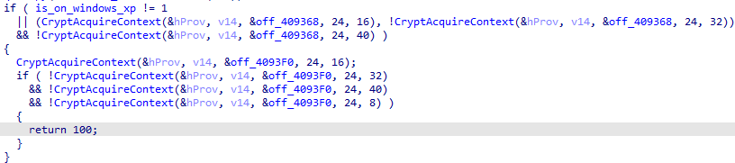
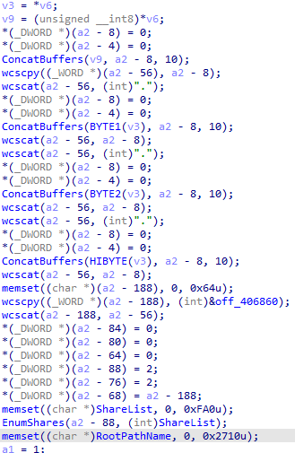

# 📂 Hermes Ransomware Analysis
Hermes is a ransomware variant first seen in 2017 and later used in the infamous Ryuk ransomware.  
This repository provides a detailed analysis of the Hermes ransomware (v2.1), explaining its inner workings, cryptographic operations, and file encryption process.

`IDA Pro` was the disassembler utilized within the report. Only the Pro version is able to create pseudo-code.

⚠️ **Disclaimer**: This analysis is strictly for educational and research purposes only. The author is not responsible for any misuse of this information.

---
## 📑 Table of Contents
The table of contents is organized to follow the logical flow of the code, presented in sequential order.
1.  [Resolving APIs and Decrypting Constants](#1-resolving-apis-and-decrypting-constants)
2.  [Global Initialization](#2-global-initialization)
3.  [Crypto Initialization](#3-crypto-initialization)
4.  [General Pre-encryption Setup](#4-general-pre-encryption-setup)
5.  [Scanning for Files](#5-scanning-for-files)
6.  [File Encryption](#6-file-encryption)
7.  [Deleting Shadow Copy and Cleaning Up](#7-deleting-shadow-copy-and-cleaning-up)
8.  [Bonus Part](#8-bonus-part)

---
## 1. Resolving APIs and decrypting consts 
The program begins with the decryption of constant values with xor with an obfuscated key.

* 

In the same function, the malwares retrieves various APIs. The fun part is that for `kernel32.dll`, developer tried to obfuscate the string with the following algorithm:
* 

And then place all characters in the right order to make `kernel32.dll`. It then imports it and
search for LoadLibraryA to load other dlls, by iterating through its export table and comparing the
strings with a custom made strcmp (since they remade all CRT functions). 
* 

After that, the following DLLs are resolved:
| DLL Name | Purpose |
|---|---|
| Mpr.dll | Net shares |
| Advapi32.dll | Registry and CryptoAPI functions |
| Ole32.dll | Only for CoInitialize |
| Shell32.dll | Used for some utility functions (discussed later) |
| Iphlpapi.dll | Not used for any function for some unknown reason | 
* 

All APIs are then imported with the previously seen custom GetProcAddress function.
* 
* 

---

## 2. Global Initialization 
After this initialization process, the malware checks if it runs on XP:
* 
* 

It needs to perform that checks to locate the correct directory to store the public key and the
encrypted private key. On higher version of windows it will store everything in /Users/Public and
on windows xp it will store everything in the windows directory:
* 

---

## 3. Crypto Initialization 
Hermes ransomware uses RSA algorithm to encrypt individual AES keys for each files.

Interestingly, this malware contains some unused function that are left like that for example
encrypting using the master public key that is hardcoded in the sample instead of generating a
session keypair:
* 

Anyways let’s see how it actually works.
It first checks if the public key file already exists. If no then it jumps to the RSA keys generations.
* 
* 

Hermes uses Crypto API (CAPI) for RSA algorithm. It firsts try to initialize many crypto providers based on the Windows XP version check:
* 

It then generates a RSA-2048 public key and a global AES-256 key and export them to their respective buffers. 
* 

And immediately writes the session public key into the `PUBLIC` file:
* 

After writing the public key it exports the private key and encrypts it with the previously generated global AES key. It then imports the attacker’s master public key and encrypts the global AES key:
* 

It then writes the the `ID` file which contains: Encrypted RSA Private Key + Encrypted global AES key
* 

After doing all this stuff, Hermes reads the previously created `PUBLIC` file and import the public session key:
* 

---
## 4. General Pre-encryption Setup 
Once the cryptographic setup is done, the program decode attackers contact addresses by the same xor algorithm with obfuscated keys as seen before, sleeps for 1 second and proceed to generating the html recovery instructions.
* 

It then writes the ransom note to its file:
* 

Hermes encryption scheme is multithreaded: It uses a huge array of wchar_t* (`tasks`) that will
contains all file paths.
* 

---
## 5. Scanning for Files 
Hermes will scan all connected drives and recursively search for files to encrypts except in CD ROMs
* 

It will also enumerates net shares on the local network:
* 
* 

About the recursive file enumeration, it’s pretty straightforward. It uses `FindFirstFileW` and compares the file names against a blacklist to avoid bricking the system.
* 
* 

When a directory is encountered it attempts to write the ransom note two times there and then do the recursion
* 

When a file is found, it compares it to the `ID_DO_NOT_REMOVE` file and the ransom note to not encrypt them:
* 

Else it will add the path to the array of paths to encrypt.

To encrypt a file it performs the following: Loops while the path list (tasks) is empty and sleeps to avoid overloading the CPU. When a path is found in the array, it dequeues it into some allocated memory, breaks the loop and increment a counter (might be used in debug mode) and then creates a thread to encrypt the file faster.
* 

---
## 6. File Encryption 
Inside the encryption thread we can see the following:
* 

In this code, the malware encrypts the file and renames it with the the following pattern appended to the original filename: `[attack@mail].HRM`

The file path are stored in some sort of struct passed as a thread parameter from the recursive function.

Let’s now detail exactly how the encryption works:

It first begins by setting the file attribute to `normal` and then opens the file with `CreateFileW` with write and read permissions:
* 

It then gets the size of the file by calling two times GetFileSizeEx:
* 

Hermes then determines if the file is a `big one` or a `small one` by comparing its size.

It will calculate the numbers of chunks to encrypt depending on the size (based on constant values).
Each chunks are 1000000 bytes long. 
* 

If the file is considered a `small` one, Hermes will calculate the number of chunks differently:
* 

Hermes will not encrypt the file if it’s below 25 bytes:
* 

Just before proceeding to the encryption part, the malware checks if the file is already encrypted.

To do that, it checks if it contains the appended `HERMES` at the end by setting the file pointer to the beginning of the footer (which is 290 bytes). If the marker is found (the file is already encrypted) and the file doesn’t have the `.HRM` extension (as seen before), it renames it and exit the function. If it doesn’t contain the `HERMES` keyword, it reset the file pointer at the beginning and proceed to encrypting the file. 
* 

To encrypt the file, Hermes generates a unique AES-256 key for the file:
* 

And then simply proceed to blocks by blocks encryption. If the read bytes count is less than the block it sets the finalize flag to true.
* 

After finishing the encryption of file’s bytes, it appends the `HERMES` marker after the encrypted content:
* 

The ransomware will encrypt the generated aes key with the session public key (from the `PUBLIC` file) by calling `CryptExportKey` and write the encrypted key at the end before closing the file and cleaning everything up.
* 

---
## 7. Deleting Shadow Copy and Cleaning Up 
Hermes creates a batch file which is named `windows.bat` and runs it to remove all possible backups. On Windows XP it will create it in the Windows directory.
* 
* 

Here is the content of that batch file:
* 

And then runs it with `ShellExecute` with administrator privileges. It will loop this call until the user clicks on `Yes` on the UAC popup unless Hermes is being ran on Windows XP:
* 

After that, Hermes shows the ransom note using `ShellExecute`, cleans everything and exits.

---
## 8. Bonus Part 
As said before there are some functionalities that were disabled such as checking if Hermes is being executed in a CIS country.
* 

And also manually scanning specified IPs
* 

And this explains itself by the fact that Hermes is a Ransomware as a Service (RaaS) sold on the dark market (dark web). The buyers can ask for custom functionalities for extra price and all of this unused code seems to be those custom functionalities that belongs to other buyers.

---
